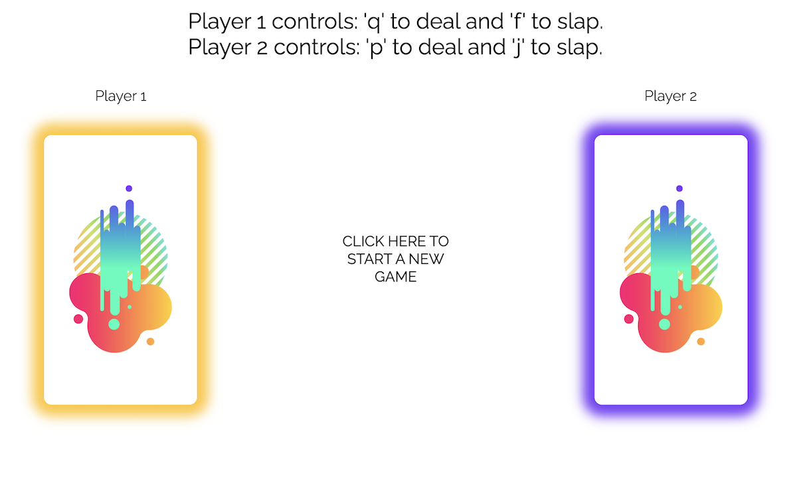
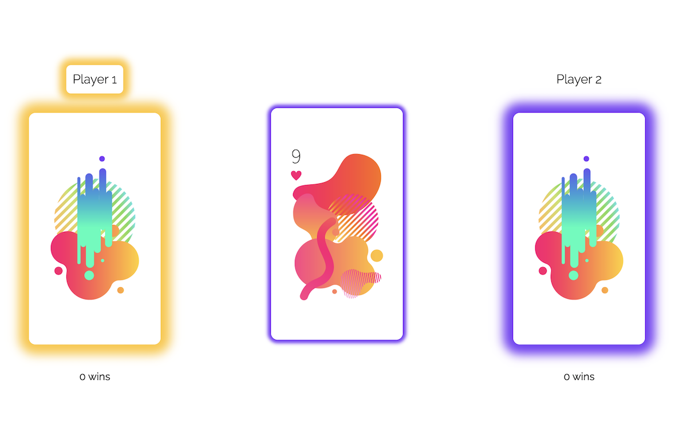
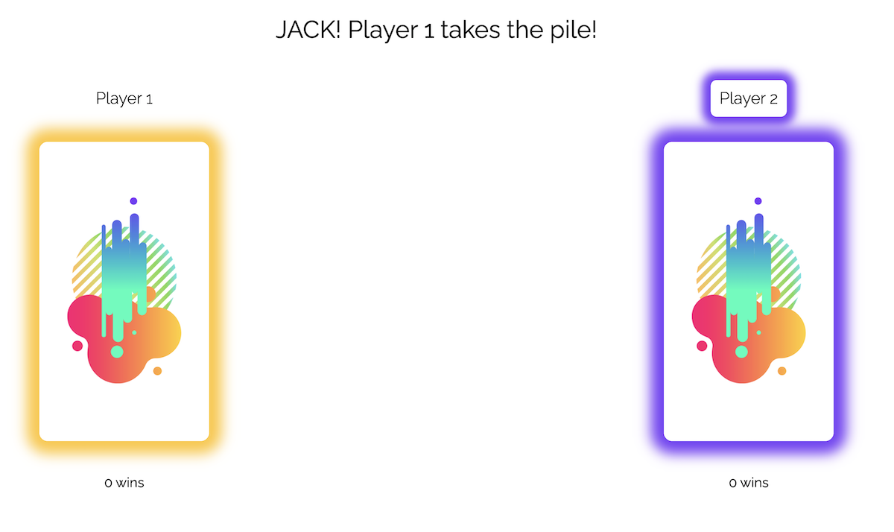
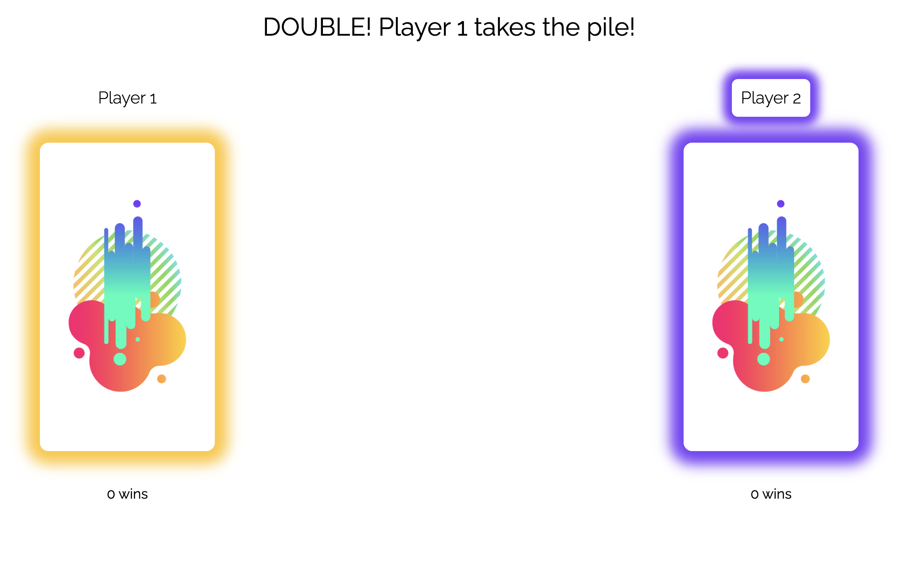
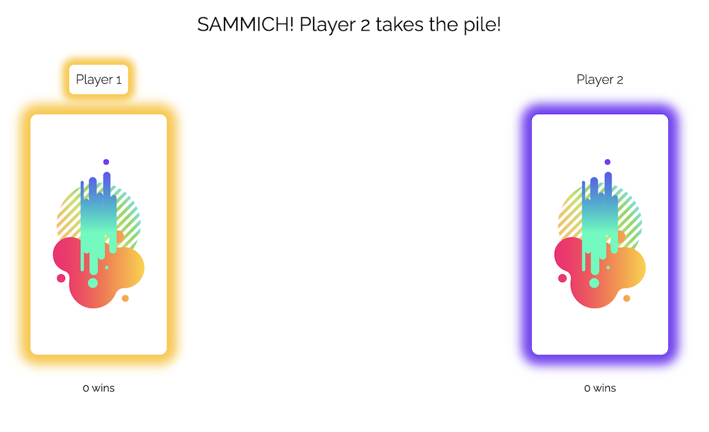
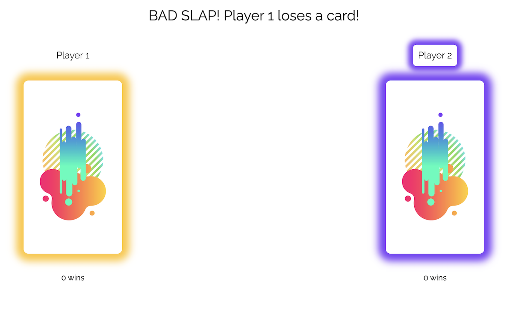
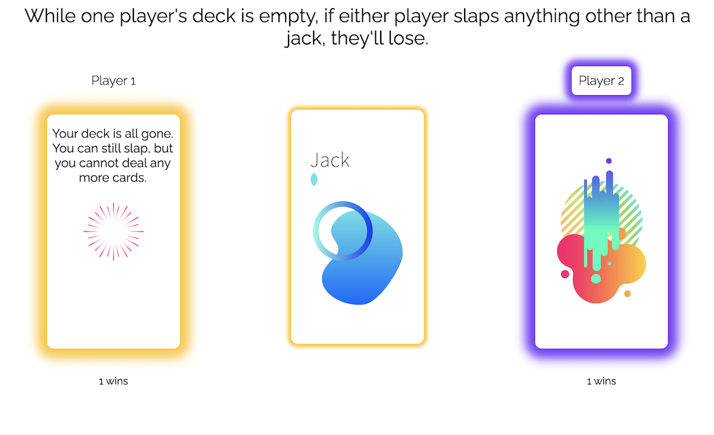
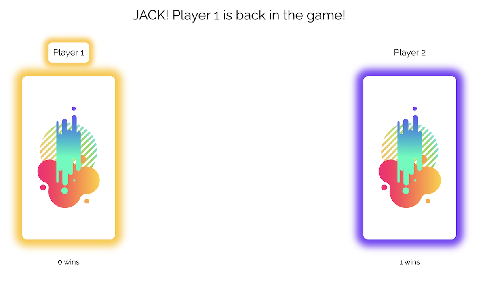
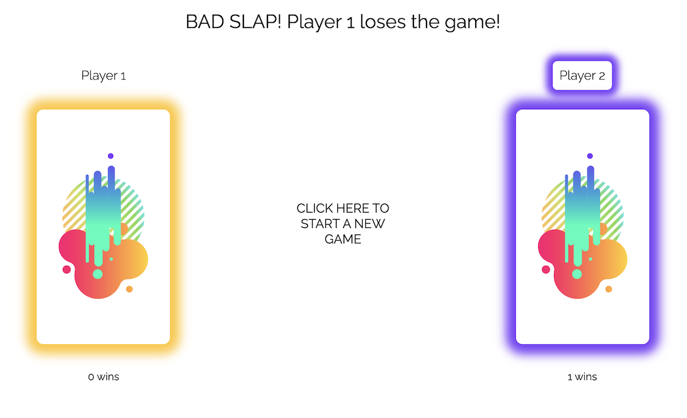
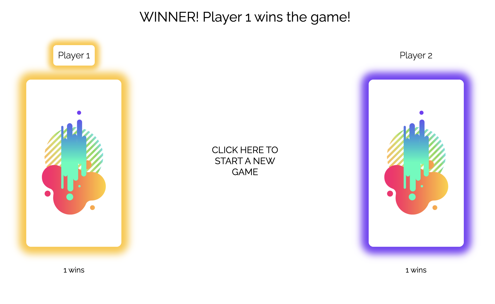

# SlapJack!
Slapjack is a card game where you take turns dealing a single card into the middle pile and slap the whole pile if you see a jack -- 
whoever SLAPS it first wins the pile. In this game, you can also win the pile if you slap doubles (two cards with the same number),
or a Sammich (two same cards with a different one in between them.). You use the keyboard to deal and to slap (after clicking in the 
center to start a new game).

## Gameplay
* Player 1 keys: 
  - `q` to deal a card
  - `f` to slap

* Player 2 keys:
    - `p` to deal a card
    - `j` to slap
  
  

* Click start!

  
    
* Players alternate turns dealing. (you'll know it's your turn because your player title will be highlighted)
* Slap on Jack, win the pile (your hand is automatically shuffled).

  

* Slap on doubles, win the pile (your hand is automatically shuffled).

  

* Slap on sammich, win the pile (your hand is automatically shuffled).
  
  
  
* Slap any other time, and you lose a card to your opponent (your top card gets put on bottom of their hand).

  

What if you're out of cards, you ask?

* When you run out, you can get back in the game by slapping a Jack. 

  

* If either player slaps anything else, any time, they'll lose.

  

* Once you're back in the game, both players can once again use doubles and sammiches.

Other rules/misc info
* You can only deal if it's your turn (you'll know that because your player title will be highlighted).
* You can only use the keys described above. Pressing any other keys will give you a notification of the keys you can choose from.
* The player with all the cards wins!

  

* Your scores will be retained and tracked when you refresh or when you start a new game.

### About me and this project
* I'm Nikki and I wrote all the code for this project. I started with basic HTML and CSS, then added BEM and Sass to spice up 
my organization in those files. Next I added a data file to hold the names of the cards so that I could access those fairly easily 
  for shuffling and dealing. Then I added the Player and Game classes, which evolved organically as I built the game play 
  organization in my main.js file. Overally, I really enjoyed the opportunity to learn on this project; I got to use a switch, 
  instead of a for loop (switches are faster), and could probably implement a similar switch in the Game class in a next 
  step of evolution for this project. I got to refresh on BEM and learned a tiny bit about Sass, which was neat. If I were 
  evolving this project I would probably implement a more robust (and hopefully slimmed down) use of Sass/BEM.

* The goal of this project was to learn how to utilize classes together with data model manipulation and DOM manipulation. I 
feel that I have a better idea of those concepts, but still need a solid overall philosophy on how to strategically plan 
  for the best separation of those things from the very beginning so that I don't have to refactor as the project evolves. I 
  think that's still my biggest challenge.
